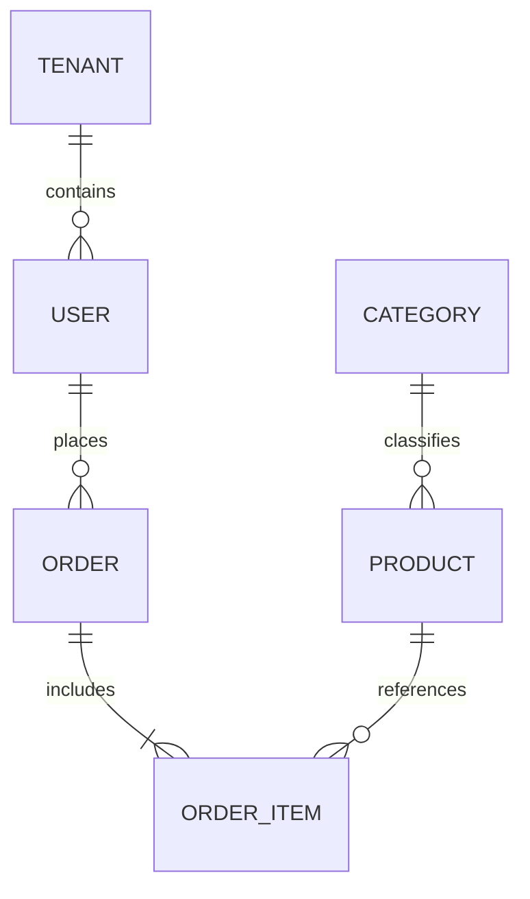

# Relational Databases & ERD Architecture Archive

Structured repository of relational database entity-relationship diagrams (ERDs), SQL DDL schemas, indexing strategies, and normalization case studies across enterprise domains.

## Architectural Case Studies

- **E-Commerce & Multi-Vendor Marketplaces**: Schemas modeling products, SKU variants, inventory stock locations, discount engines, and order lifecycle states.
- **Healthcare & EHR Information Systems**: Schemas modeling patient identities, diagnosis logs, clinical audit histories, and doctor scheduling tables with strict referential integrity.
- **Normalized Schema Design (3NF)**: Eliminating transitive dependencies, establishing surrogate and composite primary keys, and configuring foreign key constraint cascading rules (`ON DELETE CASCADE`, `ON UPDATE RESTRICT`).
- **Performance Optimization**: B-Tree indices on frequently joined foreign keys and composite indexes for multi-column lookup queries.

## Technology Stack

- **SQL Flavors**: PostgreSQL, MySQL, SQLite
- **Modeling**: Entity-Relationship Diagrams (ERD), Crow's Foot Notation, Relational Algebra
